# 🎭 Diagrama de Workflow de Orquestación Completa

Este documento contiene el diagrama visual completo del flujo de orquestación multi-especialista.

**Tema:** Fondo oscuro con colores vibrantes y texto claro para máxima legibilidad.

---

## 📊 Flujo Completo de Orquestación (5 Fases)

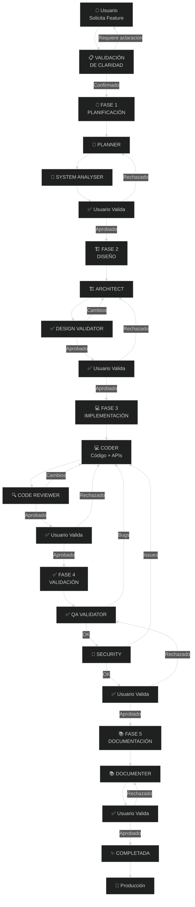

---

## 🔄 Flujo Detallado por Fase

### FASE 1: PLANIFICACIÓN ✍️

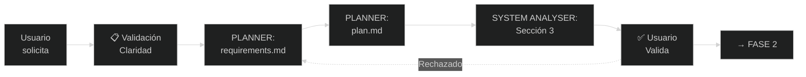

**Documentos generados en FASE 1:**
- ✅ `/docs/implementations/{nombre}/requirements.md`
- ✅ `/docs/plan-{proyecto}.md`

---

### FASE 2: DISEÑO 🏗️

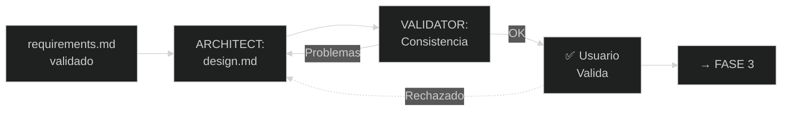

**Documentos generados en FASE 2:**
- ✅ `/docs/architecture/design-{proyecto}.md`
- ✅ `/docs/architecture/diagrams-{proyecto}.md`
- ✅ `/docs/architecture/adr-{proyecto}.md`

---

### FASE 3: IMPLEMENTACIÓN 💻

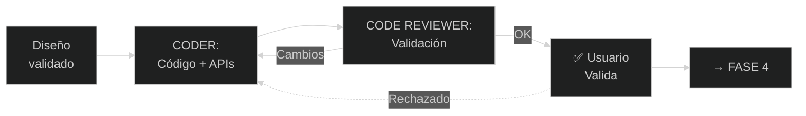

**Documentos generados en FASE 3:**
- ✅ `/docs/implementations/{nombre}/` - Implementation (código + APIs)
- ✅ `/docs/implementations/{nombre}/` - Code Review

---

### FASE 4: VALIDACIÓN ✅

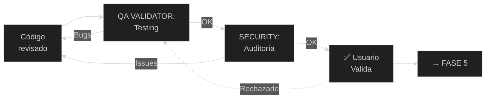

**Documentos generados en FASE 4:**
- ✅ `/docs/implementations/{nombre}/` - QA Testing
- ✅ `/docs/implementations/{nombre}/` - Security Audit

---

### FASE 5: DOCUMENTACIÓN 📚

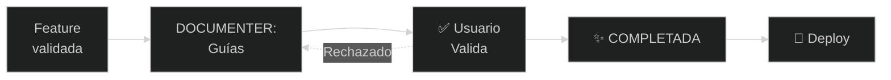

**Documentos generados en FASE 5:**
- ✅ `/docs/implementations/{nombre}/` - Documentation
- ✅ `/docs/operation/{nombre}-guide.md`
- ✅ `/docs/operation/{nombre}-setup.md`
- ✅ `/docs/operation/{nombre}-troubleshooting.md`
- ✅ `/docs/operation/{nombre}-diagrams.md`

---

## 📁 Estructura de Documentos por Fase

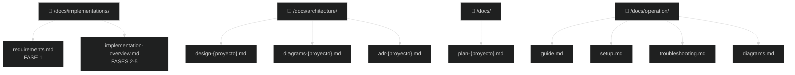

---

## 🔄 Validaciones por Fase

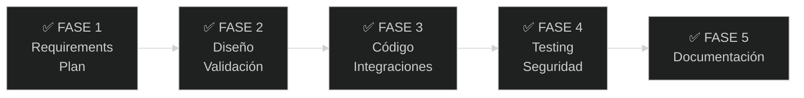

---

## 🎭 Especialistas por Fase

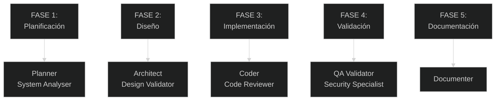

---

## ⚠️ Puntos Críticos de Control (6 Gates)

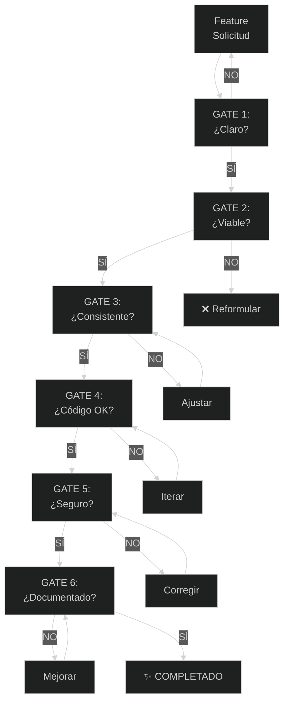

---

## 📊 Checklist de Consistencia

### ✅ Claridad de Fases
- [ ] 5 fases bien definidas
- [ ] Cada fase tiene agentes específicos
- [ ] Validación de usuario en cada fase
- [ ] Fases son secuenciales

### ✅ Responsabilidades de Agentes
- [ ] Cada agente es único
- [ ] Sin duplicación de responsabilidades
- [ ] Cada agente conoce su documento
- [ ] Interacciones bien definidas

### ✅ Documentación Viva
- [ ] Agentes verifican si documento existe
- [ ] Si NO existe → Crean analizando estado ACTUAL
- [ ] Si SÍ existe → Actualizan/complementan
- [ ] Documentación refleja realidad

### ✅ Quality Gates
- [ ] 6 gates de control
- [ ] Criterios claros en cada gate
- [ ] Gates pueden rechazar
- [ ] Escaladas definidas

### ✅ Flujo sin Bloqueos
- [ ] Sin deadlocks
- [ ] Rutas de regresión definidas
- [ ] Máximo 2 iteraciones en Code Review
- [ ] Escaladas a Architect documentadas

---

## 🎯 Caso de Uso: Multi-Proveedor LLM

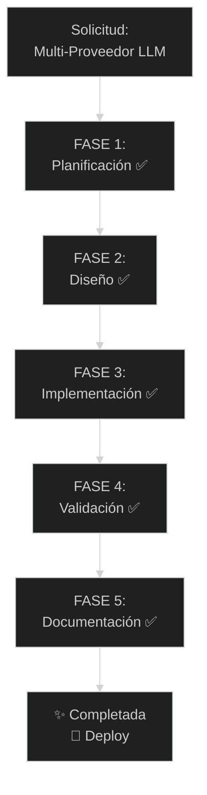

---

## 🎨 Paleta de Colores

**Tema:** Fondo oscuro con colores vibrantes

- 🔵 Azul Claro (#00a8ff): Planner
- 🟣 Púrpura (#7c3aed): System Analyser
- 🟠 Naranja (#f97316): Architect
- 🟢 Verde (#10b981): Design Consistency Validator
- 🔵 Azul (#3b82f6): Coder
- 🟣 Púrpura Claro (#a855f7): Code Reviewer
- 🟡 Amarillo (#f59e0b): QA Validator
- 🔴 Rojo Oscuro (#dc2626): Security Specialist
- 🔷 Cyan (#06b6d4): Documenter
- 🟤 Marrón (#92400e): Coordinator

---

**Última actualización:** 2025-10-31
**Versión:** 2.1 - Diagramas simplificados con tema oscuro
